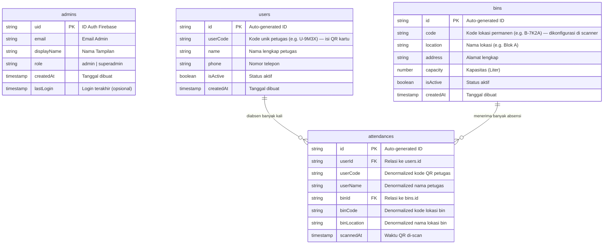

# 📊 Entity Relationship Diagram (ERD) — Smart Trash System

Dokumen ini berisi gambaran Entity Relationship Diagram (ERD) untuk Firestore Database pada project **Smart Trash System (HolyBin / TrashSync)**.

---

## 📐 Diagram ERD (Mermaid)



---

## 📝 Penjelasan Detail Koleksi

### 1. `admins`
Akun admin yang dapat login ke dashboard web.
- **`uid`**: ID dari Firebase Authentication.
- **`role`**: `admin` atau `superadmin`.

---

### 2. `users`
Petugas lapangan yang memiliki kartu QR pribadi.
- **`userCode`**: Kode unik (contoh: `U-9M3X`) yang menjadi isi QR card petugas. Setiap kali petugas menunjukkan QR ke scanner, kode ini yang dibaca.
- **`isActive`**: Jika `false`, QR petugas tidak akan diterima oleh scanner.

---

### 3. `bins`
Lokasi fisik tong sampah pintar.
- **`code`**: Kode permanen bin (contoh: `B-7K2A`). Kode ini dikonfigurasi sebagai `BIN_CODE` di file `.env` pada perangkat scanner Python yang dipasang di lokasi tersebut. Scanner tahu "saya ini bin di mana" dari kode ini.
- **`code`** bersifat permanen dan tidak berubah selama bin aktif.

---

### 4. `attendances`
Catatan setiap kali petugas scan QR di lokasi bin.
- **`userId`** + **`binId`**: Foreign key ke koleksi `users` dan `bins`.
- **`userCode`**, **`userName`**, **`binCode`**, **`binLocation`**: Denormalisasi untuk mempercepat query riwayat tanpa join manual.
- Satu dokumen = satu scan QR = satu absensi.

---

## 🔗 Penjelasan Relasi

1. **`users` ke `attendances` (One-to-Many):**
   Satu petugas bisa melakukan banyak absensi (di tempat berbeda, di waktu berbeda).

2. **`bins` ke `attendances` (One-to-Many):**
   Satu bin dapat menerima banyak scan absensi dari petugas yang berbeda-beda.

---

## 🔄 Alur Sistem

```
Admin dashboard
    ↓ tambah bin → auto-generate bins.code (e.g. B-7K2A)
    ↓ tambah petugas → auto-generate users.userCode (e.g. U-9M3X)
    ↓ cetak QR kartu petugas (isi QR = userCode)

Instalasi scanner
    ↓ tiap bin punya 1 Raspberry Pi/laptop + kamera
    ↓ set BIN_CODE=B-7K2A di scanner/.env
    ↓ jalankan: python scanner.py

Saat petugas datang ke bin
    ↓ petugas sodorkan kartu QR ke kamera
    ↓ scanner decode → dapat userCode
    ↓ POST /api/attendance { userCode, binCode }
    ↓ backend validasi user + bin aktif
    ↓ insert attendances dokumen baru
    ↓ layar scanner tampilkan "✅ Andi @ Blok A"

Admin lihat riwayat
    ↓ /history → baca koleksi attendances (diurutkan scannedAt desc)
```
