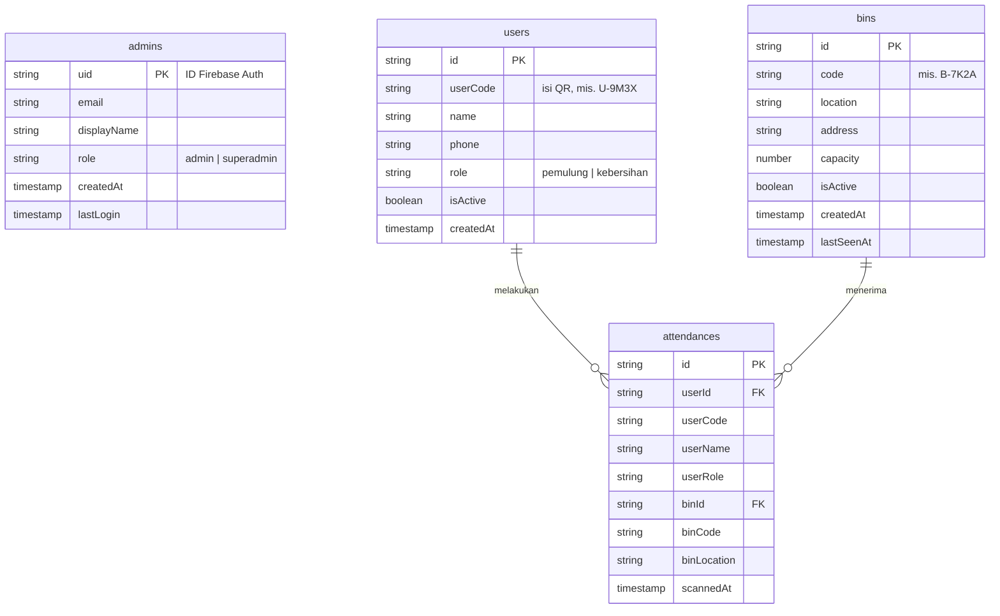
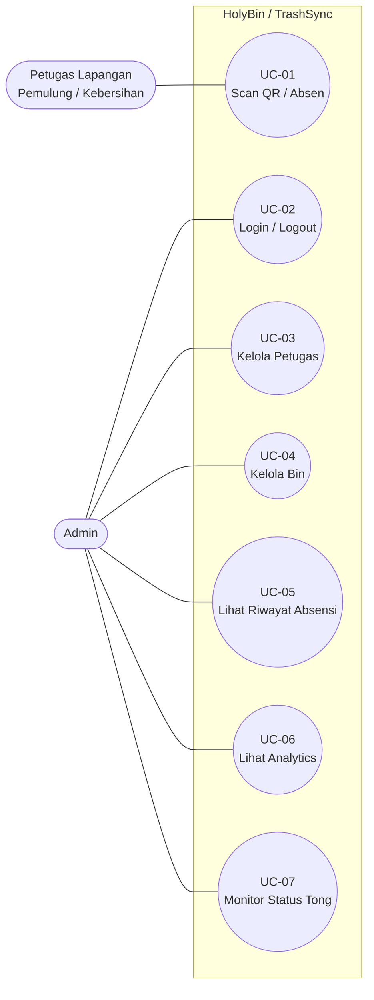

# Konteks ERD & Use Case — HolyBin / TrashSync

> Dokumen konteks untuk prompt AI / penulisan laporan-skripsi.
> Berisi (A) ERD database dan (B) Use Case sistem.
> Ringkasan project ada di `KONTEKS-PROJECT.md`.

---

# A. ERD (Entity Relationship Diagram)

Database: **Firebase Firestore** (NoSQL berbasis dokumen, tetapi dimodelkan relasional di sini).
Ada **4 koleksi/entitas** inti.

## A.1 Entitas & Atribut

### 1. `admins` — akun pengelola dashboard
| Atribut | Tipe | Keterangan |
|---------|------|-----------|
| `uid` (PK) | string | ID dari Firebase Authentication |
| `email` | string | Email login admin |
| `displayName` | string | Nama tampilan |
| `role` | string | `admin` \| `superadmin` |
| `createdAt` | timestamp | Tanggal dibuat |
| `lastLogin` | timestamp | Login terakhir (opsional) |

### 2. `users` — petugas lapangan (pemulung / kebersihan)
| Atribut | Tipe | Keterangan |
|---------|------|-----------|
| `id` (PK) | string | Auto-generated ID |
| `userCode` | string | Kode unik, mis. `U-9M3X` — **isi QR kartu petugas** |
| `name` | string | Nama lengkap |
| `phone` | string | Nomor telepon |
| `role` | string | `pemulung` \| `kebersihan` — menentukan kompartemen/servo yang dibuka |
| `isActive` | boolean | Jika `false`, QR ditolak scanner |
| `createdAt` | timestamp | Tanggal dibuat |

### 3. `bins` — lokasi tong sampah pintar
| Atribut | Tipe | Keterangan |
|---------|------|-----------|
| `id` (PK) | string | Auto-generated ID |
| `code` | string | Kode lokasi permanen, mis. `B-7K2A` — dikonfigurasi di scanner perangkat |
| `location` | string | Nama lokasi (mis. "Blok A") |
| `address` | string | Alamat lengkap |
| `capacity` | number | Kapasitas (liter) |
| `isActive` | boolean | Status aktif |
| `createdAt` | timestamp | Tanggal dibuat |
| `lastSeenAt` | timestamp | Diperbarui oleh heartbeat scanner (status online) |

### 4. `attendances` — catatan absensi tiap scan QR
| Atribut | Tipe | Keterangan |
|---------|------|-----------|
| `id` (PK) | string | Auto-generated ID |
| `userId` (FK) | string | Relasi ke `users.id` |
| `userCode` | string | Denormalisasi kode QR petugas |
| `userName` | string | Denormalisasi nama petugas |
| `userRole` | string | Denormalisasi role (`pemulung`/`kebersihan`) |
| `binId` (FK) | string | Relasi ke `bins.id` |
| `binCode` | string | Denormalisasi kode lokasi bin |
| `binLocation` | string | Denormalisasi nama lokasi bin |
| `scannedAt` | timestamp | Waktu QR di-scan |

> **Denormalisasi**: field seperti `userName`, `binLocation` disalin ke `attendances` agar query
> riwayat cepat tanpa join. Wajar untuk database NoSQL (Firestore).

## A.2 Relasi
- `users` **1 — banyak** `attendances` (satu petugas absen berkali-kali).
- `bins` **1 — banyak** `attendances` (satu tong menerima banyak absensi).
- `admins` berdiri sendiri (mengelola data, bukan relasi data transaksi).

## A.3 Diagram ERD (Mermaid)



---

# B. USE CASE

## B.1 Aktor

| Aktor | Peran |
|-------|-------|
| **Petugas Lapangan** (Pemulung / Kebersihan) | Pengguna di lapangan. **Interaksi tunggal: scan QR untuk absen** (sekaligus memicu pintu kompartemen terbuka). |
| **Admin** | Mengelola data master & memantau sistem lewat dashboard web. |
| *(Sistem)* Scanner + ESP32 | Bukan aktor manusia; perangkat yang membaca QR, mencatat ke backend, dan menggerakkan servo. |

## B.2 Daftar Use Case

### Petugas Lapangan (Pemulung / Kebersihan)
- **UC-01 Scan QR (Absen)** — satu-satunya use case petugas.
  Petugas menyodorkan kartu QR ke kamera. Sistem mencatat absensi dan membuka pintu
  kompartemen sesuai role (pemulung → recyclable, kebersihan → residu).
  *Catatan: petugas TIDAK login, TIDAK mengakses dashboard. Cukup scan.*

### Admin
- **UC-02 Login / Logout** ke dashboard.
- **UC-03 Kelola Petugas** — tambah petugas (manual / import CSV), auto-generate `userCode`,
  cetak/lihat QR petugas, nonaktifkan petugas.
- **UC-04 Kelola Bin** — tambah tong, auto-generate `code` lokasi, nonaktifkan tong, lihat daftar.
- **UC-05 Lihat Riwayat Absensi** — melihat catatan `attendances` (urut waktu, filter per bin/petugas).
- **UC-06 Lihat Analytics / Dashboard** — ringkasan statistik (jumlah absen, tren, dsb).
- **UC-07 Monitor Status Tong** — memantau tong online/offline lewat `lastSeenAt` (heartbeat).

## B.3 Diagram Use Case (Mermaid)



## B.4 Deskripsi Use Case Utama

### UC-01 — Scan QR (Absen)  *(Aktor: Petugas Lapangan)*
- **Tujuan:** mencatat kehadiran petugas di lokasi tong dan membuka kompartemen yang sesuai.
- **Prakondisi:** petugas memiliki kartu QR; `userCode` terdaftar & `isActive = true`; bin aktif; scanner berjalan.
- **Alur Normal:**
  1. Petugas menyodorkan kartu QR ke kamera scanner.
  2. Scanner men-decode `userCode` (format `U-XXXX`).
  3. Scanner mengirim `{ userCode, binCode }` ke backend `/api/attendance` (dengan token).
  4. Backend memvalidasi petugas & bin, mengecek cooldown.
  5. Jika belum absen dalam cooldown → simpan dokumen `attendances` baru.
  6. Backend mengembalikan `role` petugas.
  7. Sistem membuka pintu kompartemen (pemulung → servo 2, kebersihan → servo 3).
  8. Layar scanner menampilkan "✅ Nama @ Lokasi".
- **Alur Alternatif:**
  - *Sudah absen dalam cooldown* → ditandai `alreadyScanned`, pintu tidak dipicu ulang, tampil info.
  - *QR tidak valid / petugas nonaktif* → ditolak, tampil pesan error.
  - *Offline* → absensi disimpan lokal (SQLite) dan disinkronkan otomatis saat online kembali.

### UC-03 — Kelola Petugas  *(Aktor: Admin)*
- **Tujuan:** mendaftarkan & mengelola petugas beserta kartu QR-nya.
- **Alur Normal:**
  1. Admin membuka menu Petugas di dashboard.
  2. Admin menambah petugas (nama, telepon, role) — manual atau import CSV.
  3. Sistem meng-generate `userCode` unik (mis. `U-9M3X`).
  4. Admin mencetak / menyalin QR petugas untuk diberikan.
  5. Admin dapat menonaktifkan petugas (set `isActive = false`).

### UC-04 — Kelola Bin  *(Aktor: Admin)*
- **Tujuan:** mendaftarkan lokasi tong sampah pintar.
- **Alur Normal:** admin menambah bin (lokasi, alamat, kapasitas) → sistem generate `code`
  permanen (mis. `B-7K2A`) → kode dipasang sebagai `BIN_CODE` di perangkat scanner lokasi tersebut.

---

## Catatan Penting untuk Penulisan
- **Petugas/pemulung hanya punya 1 use case: scan QR untuk absen.** Mereka tidak login & tidak
  mengakses web. Pembukaan pintu adalah efek otomatis dari absen, bukan use case terpisah.
- Pemilahan sampah (YOLO + servo sortir) berjalan otomatis oleh sistem (mode SAMPAH), bukan
  dipicu use case aktor manusia tertentu — bisa digambarkan sebagai proses sistem, bukan use case admin/petugas.
- Aktor inti diagram use case: **Petugas Lapangan** dan **Admin**.
```
